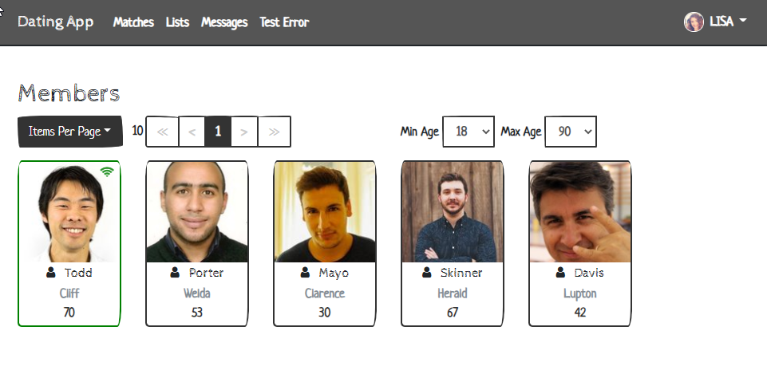

# DatingApp

This is the result of the Udemy Course "Build an app with ASPNET Core and Angular from scratch".



## Changes

- different folder structure.
- angular modules.
- integration of ngrx and ngrx/ducks.
- sketchy bootstrap theme.
- Sql Server (running in Container)

## Material Icon Settings
```json
"material-icon-theme.files.associations": {
        "*.state.ts": "Ngrx-state",
        "*.selectors.ts": "Ngrx-reducer",
        "*.reducer.ts": "Ngrx-reducer",
        "*.facade.ts": "Ngrx-actions",
        "*.effects.ts": "Ngrx-effects",
        "*.entity.ts": "Ngrx-entity",
        "*.entity-metadata.ts": "Ngrx-entity",
    },
    "material-icon-theme.folders.associations": {
        "ngrx": "Ngrx-store"
    }
```

## VS Code Extensions
### Angular
  - Angular 10 Snippets
  - Angular Essentials
  - Angular Files
  - Angular Snipptes
  - Angular Support
  - angular2-inline
  - angular2-switcher
  - vscode-angular-html
  - rxjs-snippets
  - Nx Console
  
### Bootstrap
  - Bootstrap 4, Font awesome
  - Bootstrap v4 Snippets
### C#
  - C#
  - C# Extensions
### Debugger
- Debugger for Chrome
- Debugger for Microsoft Edge

### Nuger
- NuGet Gallery
- NuGet Package Manager
  
### CSS / Sass
- CSS Peek
- Sass
- Sass Formatter
- Sass Lint
- HTML CSS Support
- Intellisense for CSS

### Typescript
- TSLint
- JSON to TS
- ESLint

### Todo
- TODO Highlight
- Todo Tree

### Miscellaneous
- Material Icon Theme
- Bracket Pair Colorizer 2
- Path Intellisense
- Prettier
- Turbo Console Log
- Auto Import
- Auto Rename Tag
- Peacock
- Color Info
- EditorConfig for VS Config
- GitLens
- npm
